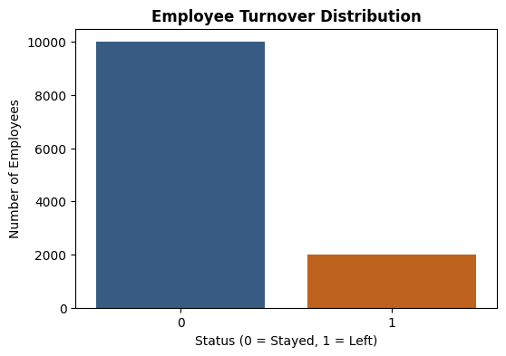
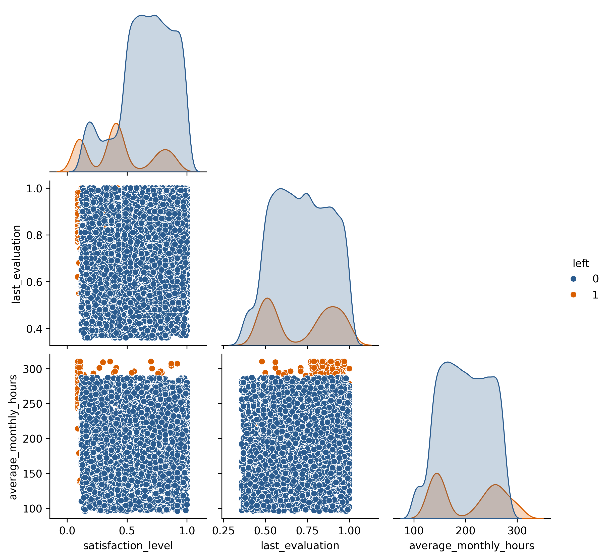
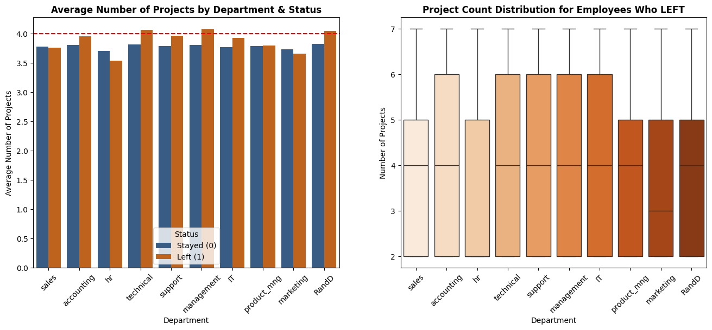
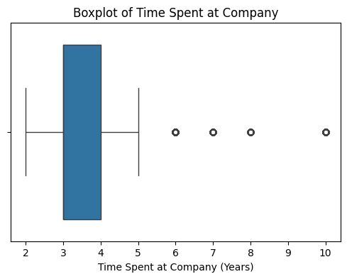
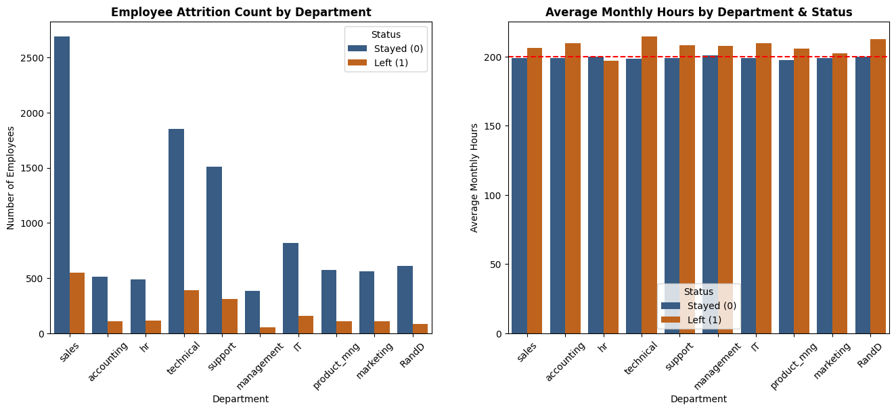
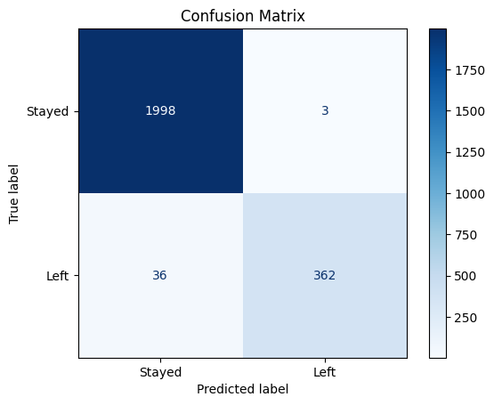
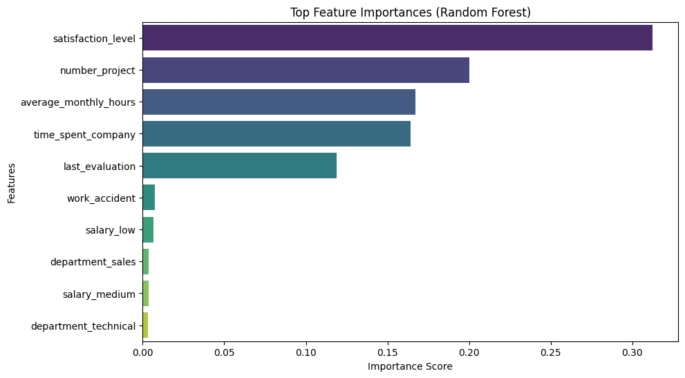

# Employee Turnover Prediction: Data-Driven Insights for HR

## Project Overview

This project analyzes employee data from Salifort Motors to identify factors associated with employee turnover and develop a machine learning model to predict whether an employee is likely to leave the company.

The project uses exploratory data analysis, data preprocessing, and a Random Forest classification model to investigate employee turnover and identify the factors that contribute most to the model's predictions.

---

## Business Problem

Employee turnover can create challenges for organizations, including recruitment costs, loss of experienced employees, and disruptions to productivity.

The goal of this project is to help HR better understand employee turnover patterns and use data-driven insights to support employee retention efforts.

---

## Project Objective

* Analyze employee characteristics and identify factors associated with turnover.
* Develop a machine learning model to predict whether an employee is likely to leave.
* Evaluate the model using appropriate classification metrics.
* Identify the most important features contributing to model predictions.
* Provide data-driven insights and recommendations for HR stakeholders.

---

## Tools & Technologies

* Python
* Pandas
* NumPy
* Matplotlib
* Seaborn
* Scikit-learn
* Jupyter Notebook
* GitHub

---

## Dataset

The dataset contains employee information including:

| Variable                | Description                                      |
| ----------------------- | ------------------------------------------------ |
| `satisfaction_level`    | Employee satisfaction level                      |
| `last_evaluation`       | Employee's latest evaluation score               |
| `number_project`        | Number of projects assigned                      |
| `average_monthly_hours` | Average monthly working hours                    |
| `time_spent_company`    | Time spent at the company                        |
| `work_accident`         | Whether the employee experienced a work accident |
| `salary`                | Salary level                                     |
| `department`            | Employee department                              |
| `left`                  | Whether the employee left the company            |

The `left` variable was used as the target variable for the classification model.

---

## Exploratory Data Analysis

Exploratory analysis was performed to understand employee turnover patterns and identify relationships between employee characteristics and turnover.

### Employee Turnover Distribution



### Satisfaction Level and Turnover



### Number of Projects and Turnover



### Time Spent at Company and Turnover



### Average Monthly Hours and Turnover



---

## Machine Learning Approach

A **Random Forest Classifier** was used to predict employee turnover.

Random Forest was selected because it can capture nonlinear relationships between variables and provides feature importance measures that help identify which variables contribute most to the model's predictions.

The workflow included:

1. Data preprocessing
2. Feature preparation
3. Train-test split
4. Random Forest model training
5. Model evaluation
6. Cross-validation
7. Feature importance analysis

---

## Model Evaluation

The model was evaluated using:

* Accuracy
* Precision
* Recall
* F1-score
* Confusion matrix
* Cross-validation

### Cross-Validation Results

The model achieved the following cross-validation accuracy scores:

```text
[0.9844, 0.9823, 0.9823, 0.9854, 0.9838]
```

The **mean cross-validation accuracy was approximately 98.36%**.

This indicates strong performance across the cross-validation folds. However, model performance should continue to be monitored when applied to new or real-world data.

### Confusion Matrix



---

## Feature Importance

The Random Forest model identified the following features as the most important:

| Feature                 | Importance |
| ----------------------- | ---------: |
| `satisfaction_level`    |      0.334 |
| `number_project`        |      0.173 |
| `time_spent_company`    |      0.167 |
| `average_monthly_hours` |      0.156 |
| `last_evaluation`       |      0.131 |

### Feature Importance Visualization



The results show that **satisfaction level** was the most influential feature in the model, followed by the number of projects, time spent at the company, average monthly hours, and last evaluation.

> Feature importance indicates which variables the model relied on most for its predictions. It does not by itself establish that a variable causes employee turnover.

---

## Key Insights

The analysis and model highlighted several important patterns:

* **Employee satisfaction** was the most important feature in the model.
* **Number of projects** was strongly associated with the model's turnover predictions.
* **Time spent at the company** was also an important factor.
* **Average monthly working hours** contributed substantially to the model.
* **Last evaluation score** also contributed to the model's predictions.

These findings can help HR identify areas that may warrant further investigation when developing employee retention strategies.

---

## Business Recommendations

Based on the findings, Salifort Motors could:

* Monitor employee satisfaction and identify areas that may negatively affect the employee experience.
* Review workload and project assignments to identify employees who may be experiencing excessive workloads.
* Monitor working-hour patterns and investigate unusually high workloads.
* Consider employee tenure when evaluating turnover risks.
* Use the predictive model as an **early-warning tool** to support HR decision-making rather than as the sole basis for decisions about individual employees.

---

## Conclusion

The model indicates that employee satisfaction, workload, and time spent at the company are important factors associated with employee turnover.

The Random Forest model achieved a mean cross-validation accuracy of approximately **98.36%**, while feature importance analysis identified satisfaction level, number of projects, time spent at the company, average monthly hours, and last evaluation as the most influential features.

As a next step, the model could be used as an early-warning tool to support HR decision-making, while continuing to collect relevant employee data and regularly evaluating and updating the model to maintain its performance.

---

## Ethical Considerations

Employee data should be handled responsibly and protected from unauthorized access.

The model should not be used as the sole basis for employment decisions. Predictions should be treated as indicators for further investigation rather than definitive conclusions about individual employees.

Model performance and potential bias should also be monitored over time to ensure responsible use.

---

## Resources

* Python
* Pandas
* NumPy
* Matplotlib
* Seaborn
* Scikit-learn
* Google Advanced Data Analytics Certificate

