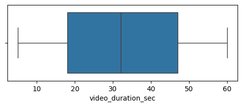
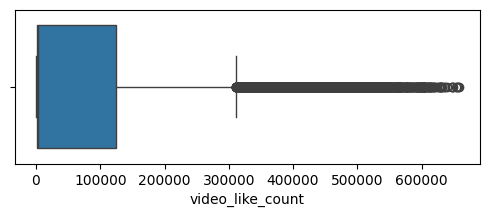
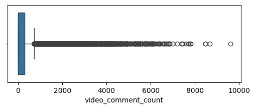
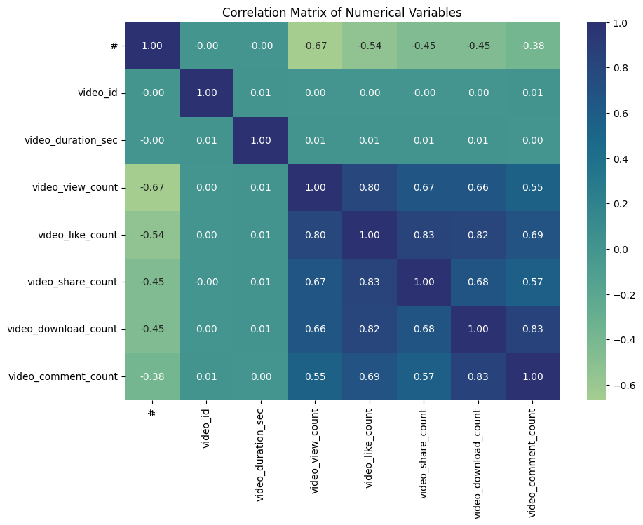

# TikTok Verified Status — Logistic Regression

## Project Overview

This project uses TikTok video data to explore whether video and engagement characteristics can help predict whether an account is **verified** or **not verified**. The project applies exploratory data analysis, class-imbalance handling, correlation analysis, feature selection, and logistic regression.

The project was completed as part of the **Google Advanced Data Analytics Certificate** and was developed as a practical classification project using Python and scikit-learn.

## Business Question

Can information about TikTok videos and their engagement help predict whether the account posting the video is verified?

## Objective

The objective is to build and evaluate a logistic regression model that predicts `verified_status` while identifying important data patterns and limitations that should be considered before using the model in practice.

## Dataset

The dataset contains **19,382 TikTok video records** and includes information about video characteristics, engagement, transcription text, and account verification status.

The target variable is `verified_status`, with two classes:

- **Not verified:** 93.71%
- **Verified:** 6.29%

The strong class imbalance makes accuracy alone an incomplete measure of model performance.

## Tools & Technologies

- Python
- pandas
- NumPy
- Matplotlib
- Seaborn
- scikit-learn
- Jupyter Notebook
- Logistic Regression

## Project Workflow

1. Data loading and inspection
2. Exploratory data analysis
3. Missing-value and duplicate checks
4. Outlier review
5. Class-balance analysis
6. Correlation analysis
7. Feature selection
8. Train/test split
9. Upsampling of the minority class **on the training data only**
10. Logistic regression modeling
11. Model evaluation on the untouched test set
12. Interpretation of results and limitations

## Exploratory Data Analysis

The EDA focused on video duration, views, likes, comments, and transcription length. Several engagement variables have highly skewed distributions, with a relatively small number of videos receiving very high levels of engagement.

### Video Duration

The distribution of video duration covers a broad range of video lengths.



### Video Views

Video view counts are highly right-skewed, with some videos receiving substantially more views than most observations.


### Video Likes

The like-count distribution contains substantial high-end values. An IQR-based review identified **1,726 potential outliers** in `video_like_count`. Because engagement variables were also strongly correlated, `video_like_count` was excluded from the final logistic regression feature set.



### Video Comments

Comment counts are also strongly right-skewed, with a relatively small number of videos receiving very high numbers of comments.



### Transcription Length

The transcription-length distributions for verified and not-verified accounts overlap, although their class frequencies differ substantially because the original dataset is imbalanced.


## Correlation Analysis

The correlation analysis showed strong positive relationships among several engagement variables. In particular, views, likes, shares, downloads, and comments are strongly related to one another.

Because highly correlated predictors can make logistic regression coefficients harder to interpret and can introduce multicollinearity concerns, `video_like_count` was removed from the final feature set.



## Class Imbalance and Data Leakage Prevention

The target variable is highly imbalanced, with verified accounts representing only 6.29% of the original data. To give the model enough examples of the minority class, the verified class was upsampled.

A key improvement in the final workflow was to **split the original data into training and testing sets before upsampling**. Only the training set was balanced. The test set remained untouched and preserved the original class distribution.

This prevents duplicated observations created during upsampling from leaking into the test set and provides a more realistic evaluation of model performance.

## Logistic Regression Model

A logistic regression model was trained on the balanced training data. The final evaluation was performed on the original, untouched test set.

The model excluded `video_id`, `video_transcription_text`, and `video_like_count` from the final feature set.

## Model Evaluation

### Final Test Results

| Metric | Result |
|---|---:|
| Accuracy | **52.88%** |
| Precision — verified | **9.85%** |
| Recall — verified | **79.67%** |
| F1-score — verified | **17.53%** |
| ROC-AUC | **67.05%** |

### Classification Report

| Class | Precision | Recall | F1-score | Support |
|---|---:|---:|---:|---:|
| Not verified | 0.97 | 0.51 | 0.67 | 4,471 |
| Verified | 0.10 | 0.80 | 0.18 | 300 |
| **Accuracy** | | | **0.53** | **4,771** |
| Macro average | 0.54 | 0.65 | 0.42 | 4,771 |
| Weighted average | 0.92 | 0.53 | 0.64 | 4,771 |

### Confusion Matrix

| | Predicted: Not verified | Predicted: Verified |
|---|---:|---:|
| **Actual: Not verified** | 2,284 | 2,187 |
| **Actual: Verified** | 61 | 239 |

## Interpretation of the Results

The model identified **79.67% of the verified accounts** in the test set, giving it relatively high recall for the minority class. However, its precision for the verified class was only **9.85%**, meaning that many accounts predicted as verified were actually not verified.

The **17.53% F1-score** for the verified class reflects the trade-off between high recall and low precision. The **67.05% ROC-AUC** indicates that the model has some ability to distinguish between the two classes, but the results do not support treating the model as a highly precise verification predictor.

Because the original dataset is heavily imbalanced, the model's 52.88% accuracy should be interpreted together with precision, recall, F1-score, and ROC-AUC rather than by itself.

## Key Findings

- The dataset is strongly imbalanced, with verified accounts representing only 6.29% of observations.
- Engagement variables such as views, likes, shares, downloads, and comments show strong correlations with one another.
- `video_like_count` had 1,726 potential IQR-based outliers and was also highly correlated with other engagement variables.
- Upsampling was applied only to the training data to avoid train/test leakage.
- The final model achieved **79.67% recall** for verified accounts but only **9.85% precision**.
- The model therefore identifies many verified accounts but also produces a large number of false positives.

## Business Interpretation

The model can be viewed as a **recall-oriented screening model** rather than a precise verification classifier. In a workflow where missing a potentially verified account is more important than minimizing false positives, the high recall may be useful. However, the low precision means that predictions would require additional review rather than being treated as definitive verification decisions.

## Limitations

- The model uses a limited set of structured video and engagement features.
- The target class is highly imbalanced in the original dataset.
- Upsampling changes the training distribution and can affect predicted probabilities and classification thresholds.
- Strong correlations among engagement variables limit straightforward interpretation of individual predictors.
- The model does not establish causation between video characteristics and verification status.
- The current results should be treated as an analytical model rather than a production-ready verification system.

## Recommendations and Next Steps

1. Compare logistic regression with tree-based classification models such as Random Forest or XGBoost.
2. Evaluate different classification thresholds to understand the precision-recall trade-off.
3. Consider class-weighted models as an alternative to upsampling.
4. Perform cross-validation on the training data.
5. Add relevant features if they are available and ethically appropriate.
6. Evaluate the model on a separate future dataset before considering operational use.

## Ethical Considerations

Account verification is a sensitive classification task. Model predictions should not be treated as proof of identity, credibility, or trustworthiness. Any operational use should include human review, monitoring for unintended bias, and careful consideration of how false positives and false negatives affect users.

## Project Files

```text
project-2-tiktok-analysis/
├── README.md
├── TikTok_Verified_Status_Logistic_Regression.ipynb
├── images/
│   ├── video_duration_boxplot.png
│   ├── video_views_boxplot.png
│   ├── video_likes_boxplot.png
│   ├── video_comments_boxplot.png
│   ├── transcription_length_distribution.png
│   └── correlation_heatmap.png
└── data/
```

## Skills Demonstrated

- Exploratory Data Analysis (EDA)
- Data cleaning and validation
- Outlier detection using the IQR method
- Correlation analysis
- Feature selection
- Handling class imbalance
- Train/test splitting and prevention of data leakage
- Logistic regression classification
- Confusion matrix analysis
- Precision, recall, F1-score, and ROC-AUC interpretation
- Communicating machine-learning results to stakeholders

## Conclusion

This project demonstrates an end-to-end classification workflow for predicting TikTok account verification status. The final logistic regression model shows strong recall for the minority class but low precision, highlighting the importance of evaluating imbalanced classification problems with multiple metrics. The project also demonstrates the importance of preventing data leakage by applying resampling only to the training data.


